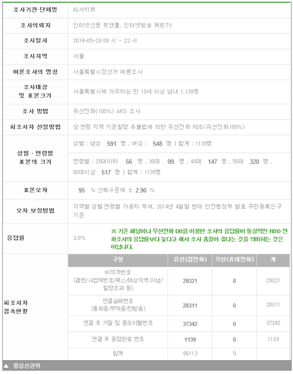

## Background 

대학원 수업으로 베이즈 통계학 과목을 수강하면서 개인적으로 관심을 가지고 있었던 선거 예측을 해보기로 했다. 물론 여론조사 자료는 [선거 관리 위원회](https://www.nesdc.go.kr) 사이트에서 직접 수집했다(손으로).  
결과적으로 이야기 하자면 예측치와 6.4 선거의 실제 지지율 차이가 불과 `0.6%`로 계산되었다. 이 수치는 엉망인 여론조사 결과까지 알면서 포함시킨 결과이고 아래 이야기 하겠지만 잘못된 여론조사를 제외했을 경우 실제 지지율 격차 `13%`를 그대로 적중시켰다. 

## Purpose 

* 박원순, 정몽준 두 후보들간의 지지율 차이 예측
* 빈도주의자들의 방법과 베이지언 방법의 결과 차이 분석 
* `6.4` 서울 시장 선거 실제 결과와 비교 


## Data 

* Data : 중앙선거관리위원회 <https://www.nesdc.go.kr>
* Range : `2014-03-24` ~ `2014-05-28`
* 여론조사 수  : 31 
* 조사기관 수 : 16
* 조사의뢰기관 수 : 21


## EDA 


```{r eda,echo=FALSE, message=FALSE, warning=FALSE,dev='png', fig.width=12}
library(MCMCpack)
library(lubridate)
library(reshape2)
library(extrafont)
library(ggplot2)


surveys <- read.csv("seoul_survey_2014_U8.csv")


surveys_new <- within(surveys, {
  N   <- 표본크기
  N_p <- 표본크기 * 박원순 /100
  N_j <- 표본크기 * 정몽준 /100
  N_e <- 표본크기 * (100 - 박원순 - 정몽준)/100 
  dt  <- ymd(조사시작)
  })


#EDA 
ggplot(melt(surveys_new, id.vars='dt', measure.vars =c('박원순', '정몽준')), aes(dt, value)) + 
  geom_point(aes(colour=variable)) + 
  stat_smooth(aes(colour=variable), method = "loess") + scale_y_continuous("Support Ratio(%)", limits=c(0,100)) + 
  scale_color_discrete("Candidates", labels=c("Park", "Jung")) + 
  ggtitle("Supports of Two Candidates \n(Loess fitting)") + scale_x_datetime(breaks='7 days') 

```

## 잘못된 여론조사 

위 그래프에서 보는 바와 같이 가장 마지막에 나온 여론조사는 이전의 여론조사 결과와 전혀 다른 결과를 보였다. 이는 모집단을 전혀 반영하지 못한 샘플링과 여론조사 방법의 문제로 기인하고 있음을 아래 표에서 확인 가능하다. 실제 이런 데이터는 제외해야 마땅하나 그대로 적용해서 모델링을 수행했다([관련 기사](http://amn.kr/sub_read.html?uid=14556&section=sc25)).  




## Multinomial Likelihood with a Dirichlet Prior

* 베이지안 : $P(\theta|X) \propto P(X|\theta)P(\theta)$
* 후보 지지자 수(j:정몽준, p :박원순, e :군소 후보/무응답)
    + $n_j, n_p, n_e$
* Likelihood 
    + $X_j,X_p,X_e \sim Multinomial(n, \theta_{n_j}, \theta_{n_p}, \theta_{n_e})$ 
* Prior 
    + $\pi(\theta_j, \theta_p, \theta_e) \propto 1$ 
    + $\theta_{n_j}, \theta_{n_p}, \theta_{n_e} \sim Dirichlet(1,1,1)$ 
* Posterior 
    + $\theta_{n_j}, \theta_{n_p}, \theta_{n_e}|n_j,n_p,n_e \sim Dirichlet(n_j + 1, n_p + 1, n_e + 1)$

위와 같이 다항 분포의 공액사전분포인 디리슐레 분포를 사용해 계산을 편하게 수행할 수 있게 하고 디리슐레 분포의 몬테칼로 시뮬레이션은 [MCMCpack](http://cran.r-project.org/web/packages/MCMCpack/index.html)의 함수(MCmultinomdirichlet)를 사용한다. 

## Steps 

1. 무정보 사전 확률 셋업
2. 새로운 여론 조사 결과가 나올때마다 이전 사전확률을 기반으로 사후확률을 계산...(반복).. Sequential Learning...
3. 몬테칼로 시뮬레이션을 수행해 각 파라메터 분포 생성(10,000 samples). 
3. 파라메터 분포를 기반으로 $\theta_p - \theta_j$ 계산 지지율 차이 분포 생성 


## Mean of Posterior

```{r mc, echo=FALSE,message=FALSE, warning=T, dev='png', fig.width=12}
library(ggmcmc, quietly = T)
library(plyr,quietly = T)

surveys_new <- surveys_new[order(surveys_new$dt,decreasing=F),]
surveys_new$N <- with(surveys_new, {N_p + N_j + N_e})


surveys_new_aggr <- ddply(surveys_new, "조사기관", summarize, N_p=sum(N_p), N_j=sum(N_j), N_e=sum(N_e), N=sum(N))


#uniform prior 
alpha <- c(1,1,1)


baye_diffs <- c()
freq_diff <- c()
ci <- c()
#sequential learning  
for(i in 1:nrow(surveys_new)){
  obs <- unlist(surveys_new[i, c("N_p", "N_j", "N_e")])
  post <- MCmultinomdirichlet(obs, alpha, mc=10000)
  baye_diffs <- append(baye_diffs, round(mean(post[,1] - post[,2]), 3))
  alpha <- (alpha + obs)
  
  #samp <- rdirichlet(n, as.vector(alpha))
  #obs[1]/sum(obs) 
  #p <- obs[1]/sum(obs)
  #plus_minus <- qnorm(0.975) * sqrt( (obs[1]/sum(obs) * sum(obs[c(2,3)])/sum(obs))/(sum(obs) - 1))
  #print(sprintf("%f +- %f", p, plus_minus))
  
  p_1 <- obs[1]/sum(obs)
  p_2 <- obs[2]/sum(obs)
  conf_interval <- qnorm(0.975) * 1/sqrt(sum(obs)) * sqrt(p_1 *(1- p_1) + p_2 * (1 - p_2) + 2 * p_1 * p_2)
  freq_diff <- append(freq_diff, p_1 - p_2)
  ci <- append(ci, conf_interval)
}


diff_dist <- data.frame(diffs_val=as.numeric((post[,1] - post[,2])))

mdiff <- mean(diff_dist$diffs_val)

ggplot(diff_dist, aes(diffs_val)) + geom_histogram(binwidth=0.001) + geom_vline(x=get('mdiff',envir =.GlobalEnv)) + 
  scale_x_continuous(breaks=round(c(seq(0.10, 0.15, by=0.01), get('mdiff',envir =.GlobalEnv)),3)) + xlab(expression(mean~of~theta[p]-theta[j])) 

```

위 그래프는 각 후보 지지율 추정치를 시뮬레이션한 1만개의 값들 사이의 차이를 그래프로 도식화한 것이다. 그래프가 좌우 대칭이기 때문에 평균값을 대표값으로 하기엔 충분하며, 정확히 `r mdiff * 100`%로 지지율 차이를 추정함을 볼 수 있다. 실제 값인 `13%`에 상당히 근접함을 알 수 있다. 


## Comparison between Frequentist and Bayesian 

* 전통적 모비율 차이 추정식(Frequentist's) .. 근사치 계산식임 
    + $\hat{p_p} - \hat{p_j} \pm \frac{Z_{a/2}}{\sqrt{N}}\sqrt{\frac{N - n}{N}}\sqrt{\hat{p_p}(1 - \hat{p_p}) + \hat{p_j}(1 - \hat{p_j}) + 2\hat{p_p}\hat{p_j}}$

```{r comp, echo=FALSE,message=FALSE, warning=T, dev='png',fig.width=15, fig.height=7}
res <- rbind(data.frame(dt=surveys_new$dt, diff_kind="freq", diff_ratio=freq_diff, ci=ci),
      data.frame(dt=surveys_new$dt, diff_kind="bayes", diff_ratio=baye_diffs, ci=0)
      )


Np <- sum(surveys_new$"N_p")
Nj <- sum(surveys_new$"N_j")
sumtotal <- Np + Nj

p_p <- Np/sumtotal
p_j <- Nj/sumtotal

freq_diff_r <- Np/sumtotal - Nj/sumtotal
ci_r <- qnorm(0.975) * 1/sqrt(sumtotal) * sqrt(p_p *(1- p_p) + p_j * (1 - p_j) + 2 * p_p * p_j)
ymax <- freq_diff_r + ci_r
ymin <- freq_diff_r - ci_r

res <- rbind(res, data.frame(dt=ymd('2014-06-01'), diff_kind="freq_total", diff_ratio=freq_diff_r, ci=ci_r))


#melt(res, id.vars='dt', measure.vars=c('freq_diff', 'bayes_diff'))

ggplot(res, aes(x=dt,y=diff_ratio, colour=diff_kind)) + geom_point() + geom_line() + 
  geom_errorbar(aes(ymin=diff_ratio-ci, ymax=diff_ratio+ci), linetype=3, width=0) +  
  geom_hline(yintercept=0.13, linetype=2) + 
  geom_text(data=NULL,x=as.numeric(ymd('2014-04-01')) , y=freq_diff_r, label="6.4 Result", vjust=0, colour='black', size=5) + 
  scale_x_datetime("date",breaks = "7 days") +
  scale_y_continuous( expression(theta[p] - theta[j]), breaks=seq(-0.01,0.25, by=0.01)) + scale_color_discrete("Inference Methods")

```

위 그래프에서 붉은선은 위 식을 이용해 추정한 지지율 차이이고 점의 상하에 길게 늘어선 라인은 각 여론조사의 `95%`신뢰구간을 의미하며 검은 점선은 실제 지지율 차이 `13%`를 의미한다.  파란점은 모든 여론조사 결과를 결합해 추정한 추정치와 신뢰구간이다. 반면 녹색 라인과 점은 베이지언을 이용한 추정치인데, 가장 마지막 여론조사 직전에 정확히 `13%`를 히트하나 마지막 여론조사 결과를 적용한 이후 정확도가 다소 떨어진걸 볼 수 있다. 역시나 잘못된 여론조사는 넣는것보다 빼는게 나아 보인다. 


## 마치며 

금번 작업을 수행하면서 다시한번 베이지언 방법의 강점을 느끼게 되었다. 좀더 데이터를 보강하고 베이지언 계층모형을 활용하면 조사기관 편향이나 의뢰자 편향같은 것도 분석해볼 가치가 있을것으로 보인다. 무엇보다 모수 분포 전체를 추정하는 베이지언은 별도로 부연설명이 필요없이 깔끔하기 그지 없으며 게다가 결과도 꽤 만족스럽다. 게다가 컴퓨팅 기반의 몬테칼로 시뮬레이션은 통계학과 컴퓨터 공학이 만나는 아주 매력적인 영역임에는 틀림없고, 분포를 다양한 관점에서 조망할 수 있다는 큰 장점이 있는거 같다. 

그리고 언제나 옮은 `Garbage in, garbage out`... 역시 쓰레기 자료는 안넣는게 낫다. 


## References 
  * Gelman, et. al. Bayesian Data Analysis 3nd (2013, p. 69)
  *  Andrew D. Martin, Kevin M. Quinn, Jong Hee Park (2011). MCMCpack: Markov Chain Monte Carlo in R. Journal of
  Statistical Software. 42(9): 1-21. URL http://www.jstatsoft.org/v42/i09/.

## Code and Data
  * <https://github.com/haven-jeon/2014_Seoul_Mayoral_Election_Analysis>


