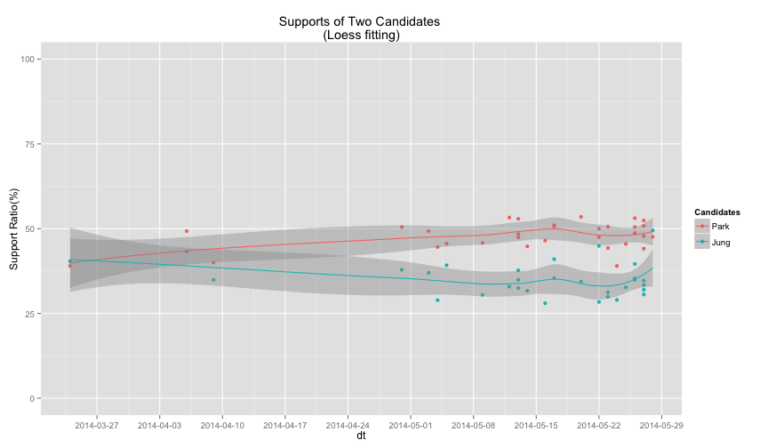
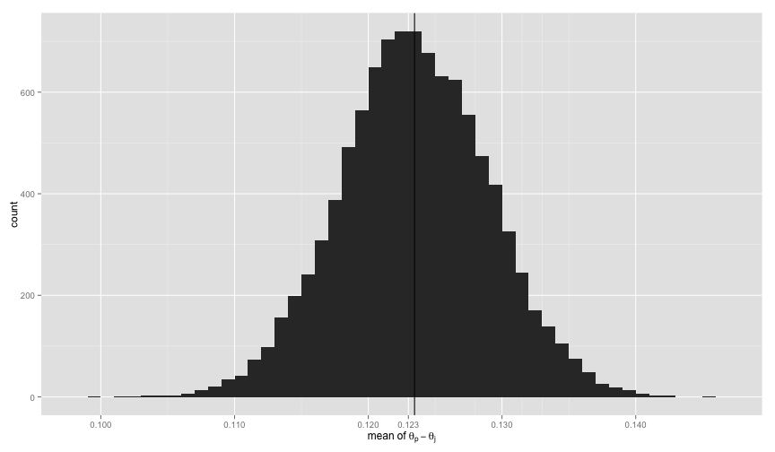
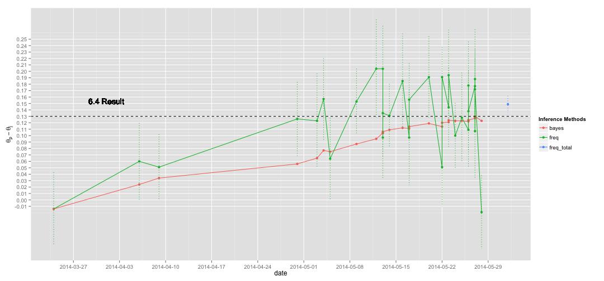

## Background 

> 베이지언은 선거 예측에 많이 사용되어진 방법론이다. 가장 먼저 튜키 교수가 선거 예측에 베이지언을 사용했다고 알려져 있으며 이후 같은 방식으로 네이트 실바가 2008년에 미국 50개 주 중 49개 주, 그리고 2012년에는 50개 주 전체의 대선 결과를 정확히 예측하여 일대 파장을 일으켰다. 한국에서는 서울대학교 정치학과 박종희 교수가 지난 2013 대선 결과를 1%의 에러로 예측한  사례가 있다. 

## Purpose 

* 박원순, 정몽준 두 후보들간의 지지율 차이 예측
* 빈도주의자들의 방법과 베이지언 방법의 결과 차이 분석 
* `6.4` 서울 시장 선거 실제 결과와 비교 

## Data 

* Data : 중앙선거관리위원회 <https://www.nesdc.go.kr>
* Range : `2014-03-24` ~ `2014-05-28`
* 여론조사 수  : 31 
* 조사기관 수 : 16
* 조사의뢰기관 수 : 21

## EDA 

 

## Multinomial Likelihood with a Dirichlet Prior

* 베이지안 : $P(\theta|X) \propto P(X|\theta)P(\theta)$
* 후보 지지자 수(j:정몽준, p :박원순, e :군소 후보/무응답)
    + $n_j, n_p, n_e$
* Likelihood 
    + $X_j,X_p,X_e \sim Multinomial(n, \theta_{n_j}, \theta_{n_p}, \theta_{n_e})$ 
* Prior 
    + $\pi(\theta_j, \theta_p, \theta_e) \propto 1$ 
    + $\theta_{n_j}, \theta_{n_p}, \theta_{n_e} \sim Dirichlet(1,1,1)$ 
* Posterior 
    + $\theta_{n_j}, \theta_{n_p}, \theta_{n_e}|n_j,n_p,n_e \sim Dirichlet(n_j + 1, n_p + 1, n_e + 1)$

## Steps 

1. 무정보 사전 확률 셋업
2. 새로운 여론 조사 결과가 나올때마다 이전 사전확률을 기반으로 사후확률을 계산...(반복)
3. 몬테칼로 시뮬레이션을 수행해 각 파라메터 분포 생성(10,000 samples). 
3. 파라메터 분포를 기반으로 $\theta_p - \theta_j$ 계산 지지율 차이 분포 생성 

## Mean of Posterior

 

## Comparison between Frequentist and Bayesian 

* 전통적 모비율 차이 추정식(Frequentist's)
    + $\hat{p_p} - \hat{p_j} \pm \frac{Z_{a/2}}{\sqrt{N}}\sqrt{\frac{N - n}{N}}\sqrt{\hat{p_p}(1 - \hat{p_p}) + \hat{p_j}(1 - \hat{p_j}) + 2\hat{p_p}\hat{p_j}}$

 

## Conclusion

* 전통적인 여론조사 기반 예측은 개별 건에 대한 예측값만 도출하나 베이지언은 여러 데이터를 기반으로 시계열적인 특징을 부여해 예측할 수 있다. 
* 베이지언은 꽤 정확한 결과를 도출해 준다(0.0064 error). 
* `2014-05-28`일자의 잘못된 여론조사 결과를 제외할 경우 실제 결과인 `13%` 차이를 정확히 예측한다.  

## Q & A

* References 
    + Gelman, et. al. Bayesian Data Analysis 3nd (2013, p. 69)
    + Andrew D. Martin, Kevin M. Quinn, Jong Hee Park (2011). MCMCpack: Markov Chain Monte Carlo in R. Journal of
  Statistical Software. 42(9): 1-21. URL http://www.jstatsoft.org/v42/i09/.
* Code and Data
    + <https://github.com/haven-jeon/2014_Seoul_Mayoral_Election_Analysis>

